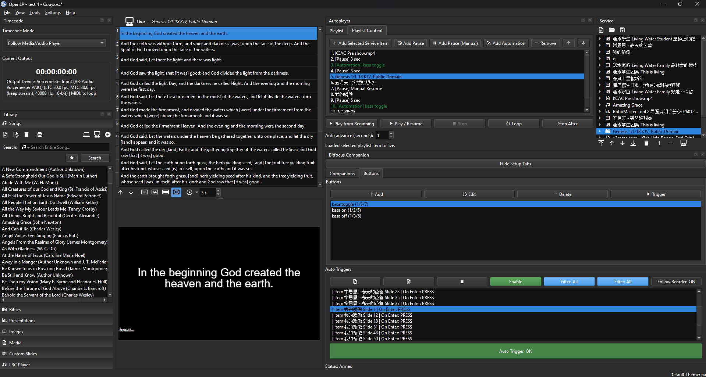
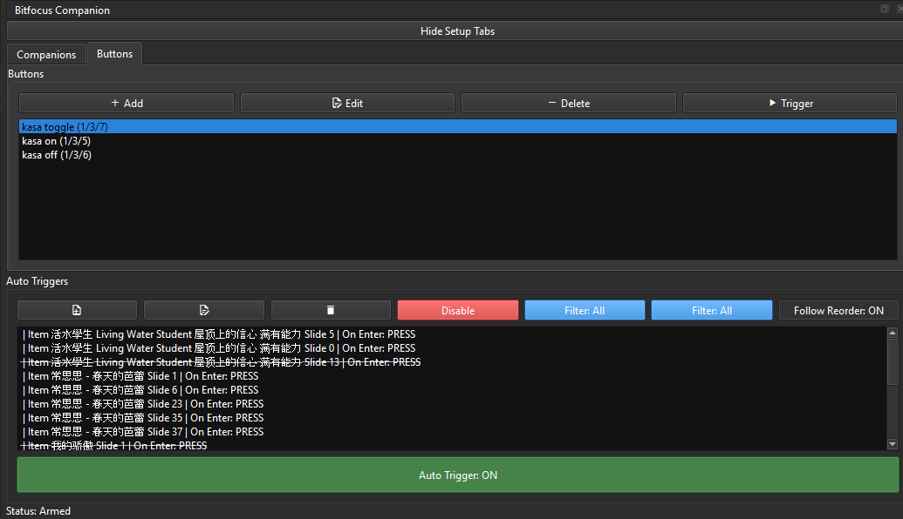
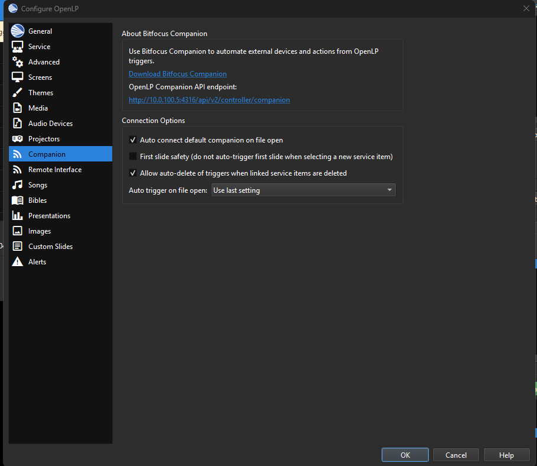
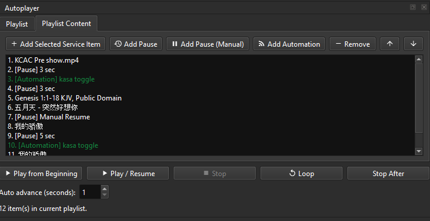
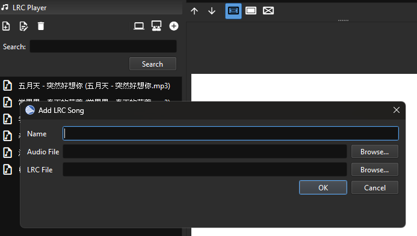
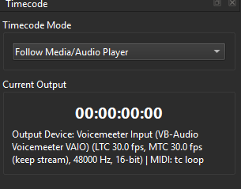
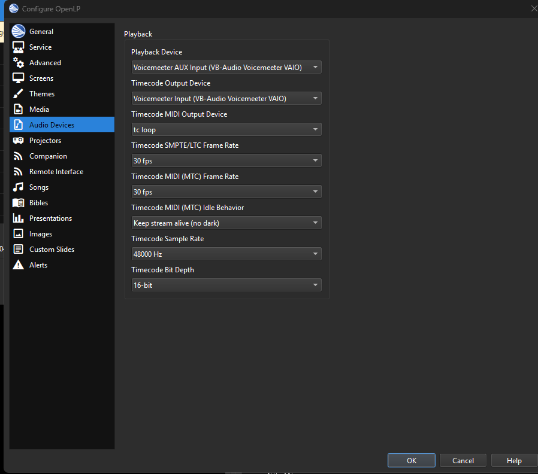
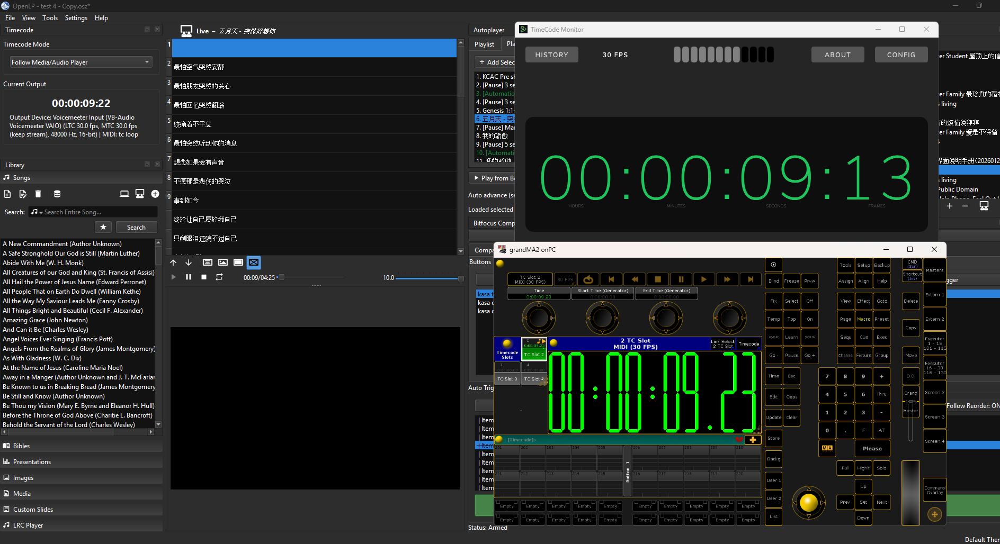

This is a fork from https://gitlab.com/openlp

## Added Features

### Bitfocus Companion Automation - Auto trigger
OpenLP can automatically send triggers to Bitfocus Companion based on playback and service actions, reducing manual button presses during live operation.

### Autoplayer
Adds automatic playback control for media and service flow, helping operators run cues consistently with less manual intervention.

### LRC Player
Adds synchronized lyric playback support using LRC files, making it easier to follow timed lyric lines during songs.

### MTC and SMPTE
Adds timecode output support for both MIDI Time Code (MTC) and SMPTE/LTC workflows, including selectable output devices and frame-rate options for external sync with lighting, audio, and show-control systems.

## OpenLP

You're probably reading this because you've just downloaded the source code for OpenLP. If you are looking for the installer file, please go to the download page on the web site:

https://openlp.org/#download

If you're looking for how to contribute to OpenLP, then please look at the OpenLP wiki:

https://wiki.openlp.org/

Thanks for downloading OpenLP!
